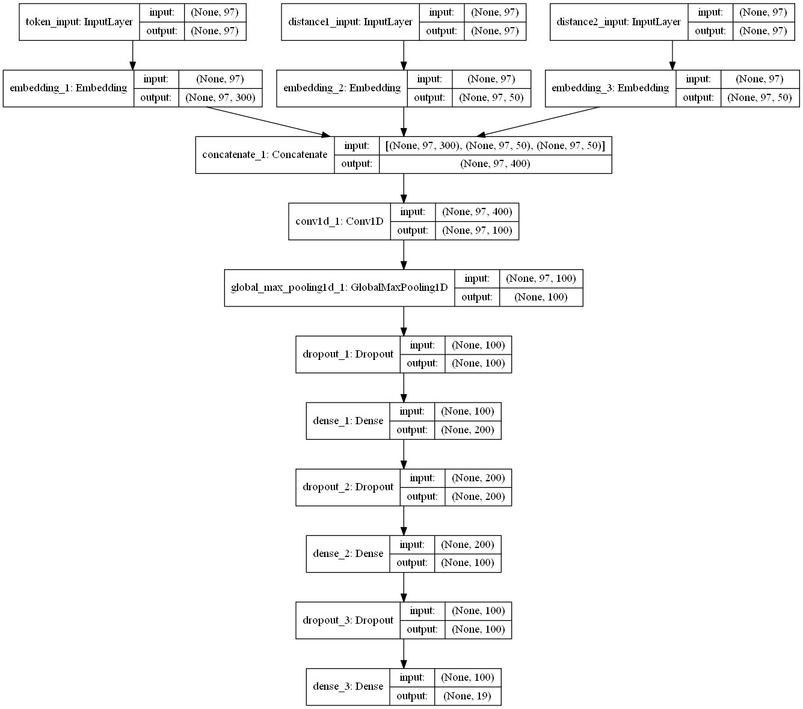

# keras-cnn-relation-classificaiton
Relation Classification via Convolutional Neural Network

## Network Structure

Different from (Zeng et al. 2014) edition, I use a extern pre-trained word vector (with a dimension of 300) from Wikipedia instead of their Google News' vector (50 dims). Moreover, I do not add the WordNet features into the model. Besides, the optimizer is `Adam` instead of `SGD`.





## Files

`config.py`   configurations
`utils.py`   data pre-process
`word2vec.py` load pretrained word2vec model
`train.py`    train the model

## Requirements

numpy=1.13.3
keras=2.2.4

## How to use

```bash
python utils.py
python train.py # or just run this command to train the model by using a pre-trained dataset
```

## References

- Zeng D, Liu K, Lai S, et al. Relation Classification via Convolutional Deep Neural Network[C]. international conference on computational linguistics, 2014: 2335-2344.
- Zeng D, Liu K, Chen Y, et al. Distant Supervision for Relation Extraction via Piecewise Convolutional Neural Networks[C]. empirical methods in natural language processing, 2015: 1753-1762.
- Santos C N, Xiang B, Zhou B, et al. Classifying Relations by Ranking with Convolutional Neural Networks[J]. international joint conference on natural language processing, 2015: 626-634.
- [Wikipedia Word Vectors](https://www.cs.york.ac.uk/nlp/extvec/)
- [Deeplearning4nlp Tutorial](https://github.com/UKPLab/deeplearning4nlp-tutorial)
- [CNN in Keras with Pretrained Word2Vec Weights](https://www.kaggle.com/marijakekic/cnn-in-keras-with-pretrained-word2vec-weights)